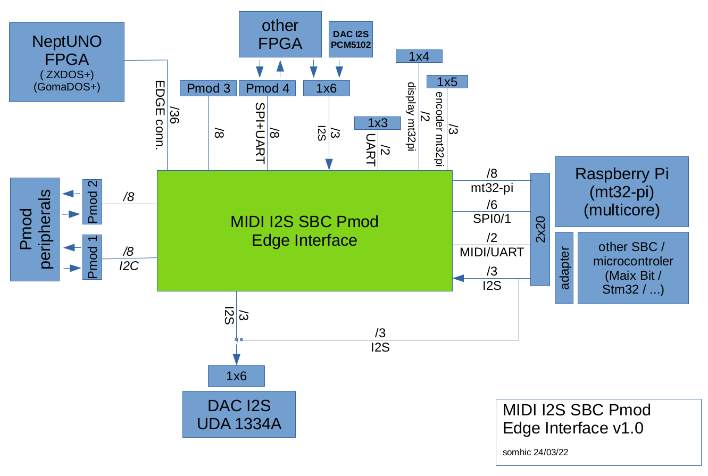

# MIDI I2S SBC Pmod Edge Interface

STATUS (26/12/22): Finished gerber files for v1.10. See changelog for updates from v0.7 to v1.1

STATUS (24/03/22): Finished most of testing satisfactorily. 

STATUS (24/03/22): received pcbs (16/03/22) and started testing.  

STATUS (01/03/22): sent v0.70 to manufacturing at JLCPCB

### Intro

This board was born as an addon for [NeptUNO](https://github.com/neptuno-fpga/Main_nepUNO/wiki) FPGA platform (although it can be linked to other FPGAs) for interfacing with a MIDI synthesizer (mt32-pi), DAC I2S, single board computers (or microcontrollers) and pmod peripherals.

This is my first PCB design attempt. 

Project has been developed with KiCAD 6.0.

This design is based on the Eagle design of the RTC+I2S+PIzero Addon by [Antonio Villena](https://www.antoniovillena.es/store/). I have to thank Antonio for his help.

### Flow diagram



### **Schematic**

[addon-edge-rpi-i2s-pmod.pdf](addon-edge-rpi-i2s-pmod.pdf)

### **Features**

* MIDI synthesizer: [mt32-pi](https://github.com/dwhinham/mt32-pi) 
  
  * Play MIDI sounds from FPGA core through an I2S DAC
  * It is possible to send mt32-pi I2S audio back to FPGA for mixing with other core audio and play it back through the I2S DAC
  * PCB includes footprints for an I2C OLED display, a rotative encoder and 2 buttons
  * Control mt32-pi through i2c pins (e.g. from MiSTer's OSD)
  
* DAC I2S: 
  
  * Play I2S audio sent from your FPGA (connected to Edge or Pmod 4)
  * Play I2S audio from Raspberry mt32-pi
  * PCB includes footprints for UDA 1334A and PCM5102A
  
* SBC / Micro-controller interface (Multicore)
  * Interface to FPGAs through Edge or Pmod 4 connectors
  * Interface signals: SPI (6 signals) and UART (Rx/Tx) 
  * PCB includes footprint for Raspberry Pi model B 40 pin connector. Other SBCs or microcontrollers can be interfaced through adapters (e.g. MAix BiT and STM32 adapters are available in [Atlas FPGA project](https://github.com/atlasfpga))
  * A SBC or uC could be used as a multicore device for the FPGA
  
* UART header connected to FPGA (Rx, Tx) (and Raspberry Pi also)

  

**Additional features for the Edge connector ** 

* Compatible platforms: NeptUNO, ZXDOS+ and GomaDOS+ from [Antonio Villena](https://www.antoniovillena.es/store/). 
  * NeptUNO base board is compatible with most of QMTech FPGAs
* PMODs 1 & 2 for double Pmod peripherals (like Hyperram, VGA, HDMI, ....)
  * Pmod 1 is connected to I2C lines of NeptUNO base board
  * Includes a 5V power supply header between Pmods  for broader compatibility
* PMODs 3 & 4  
  * Can be used as host or peripheral pmods (jumper JP5 enables output power). 
  * Includes a 5V power supply pin between Pmods  for broader compatibility
  * Notes:
    * Double Pmod for peripherals is only possible if not using mt32-pi or multicore options
    * Pmod 3 cannot be used with NeptUNO board cores usign SRAM

### 3D model


### **Usage notes**

* It is recommended to power supply first the FPGA and thereafter the MISI2SBC addon
  
* DAC I2S 
  
  * Only one DAC (either UDA 1334A or PCM5102A) is intended to be used at the same time, although should be possible to run them simultaneously.
  * DAC input voltage can be selected by jumpers from Edge, Raspberry Pi or other FPGA
  * PCM5102A connector is compatible with a 6 pin Pmod if JP11 jumper is removed.
  
* SPI communication between Raspberry Pi and FPGA
  * SPI 0 or SPI 1 is available (selection by jumpers JP4x) 
  * External FPGAs are to be connected to Pmod4 (SPI + UART)

* mt32-pi synthesizer
  * Power supply: JP11 set to RPI and short JP12 with a jumper
  * DAC source from FPGA: SPI 1 should be selected when using mt32-pi (jumpers JP4x)
  * DAC source from RPi: No jumper or SPI 0 should be selected when using mt32-pi (jumpers JP4x)
  * External FPGAs are to be connected to Pmod I2S (PCM5102A) and MIDI In (UART) or Pmod4 (SPI + UART) for mixing.
  * MiSTer OSD i2c control: short jumpers JP31, JP32 and remove jumpers from JP41, JP45.
  
  

### **Jumpers / Switches selection**

The board has several jumpers for a broader usage with multiple configurations. Instead of right angle pin headers with jumpers is also possible to use 3 pin mini switches.

**Jumper types**

* 2 pin jumper is either shorted (jumper on) or disconnected (without jumper)

* 3 pin jumper is either on one side or the other always connecting the central pin

**Jumper selection**

* DAC I2S Power supply input source  

  * JP11:  RPI / EDGE   (3 pin jumper)
    * RPI (5V from Raspberry Pi)
    * EDGE (5V from Edge connector (NeptUNO FPGA))
  * JP12  (2 pin jumper)

    * Jumper shorting JP11 and VIN (5V from selection of JP11 jumper is applied to VIN)
    * Without jumper (DAC power input comes from any VIN pin (J4, J5 or J12 Vin itself))

* DAC I2S Audio Source (3 pin jumper)
  * DAC I2S connected to FPGA: I2S sound from MIDI synthesizer mt32-pi (MIDI_CLKBD, MIDI_WSBD, MIDI_DABD signals) is routed to the FPGA (where could be mixed with other core sounds) and the FPGA sends the I2S signals back to the DAC I2S (BCLK, WSEL, DIN signals).
    * JP21, JP22, JP23 jumper connected to the FPGA mark side
  * DAC I2S connected directly to the MIDI synthesizer (mt32-pi)
    * JP21, JP22, JP23   jumper connected to the RPI mark side

* SPI / I2C selection  (2 pin jumpers)

  * SPI selection: JP31 and JP32 open.
  * I2C selection: JP31 and JP32 closed (central pins of MOSI JP41 and CE1 JP45 are wired to the I2C bus connected to the mt32-pi (RPi). Jumpers JP41 and JP45 should be removed to avoid interferences).

* SPI selection: SPI0 or SPI1 (3 pin jumper)

  * SPI0: JP41, JP42, JP43, JP44, JP45  jumper connected to the SPI0 mark side
  * SPI1: JP41, JP42, JP43, JP44, JP45  jumper connected to the SPI1 mark side

* Power supply selection for pins 1 and 2 of the I2C OLED display

  * You might find in the marked I2C displays that need 3V3 on pin 1 and GND on pin 2 whereas others those pins are exchanged

  * JPS1 is a 3 pad solder jumper

    * Solder central pad to either 3V3 or GND for selecting function of PS1 display pin 1

  * JPS2 is a 3 pad solder jumper

    * Solder central pad to either 3V3 or GND for selecting function of PS2 display pin 2

* Power supply for PMOD3 & PMOD4 ( JP5 2 pin jumper )

  * Use as Peripheral pmods: JP5 opened  (No voltage is supplied into VH pins)
  * Use as Host pmods: JP5 closed (3V3 voltage from board is wired into VH pins)

  

### Notes regarding NeptUNO base board

* Following shared pins of Pmod 1 will only work with slow signals because they are connected to the I2C circuit of the VGA monitor. 

```
PMOD1_D2   I2C SCL    RTC,   VGA  
PMOD1_D3   I2C SDA    RTC,   VGA  
```

A simple way to solve this is to remove pins 12 and 15 with a plier from the VGA connector of the extension cable to the monitor as shown in the following picture:


* In order to use PMOD1_D5 pin it is required to configure in Quartus as following (Device and Pin Options : Dual-Purpose Pins: nCEO : Use as regular I/O)

   

  

* B24 Edge pin is connected in NeptUNO board internally to the Joy Select signal by means of a solder pad which by default is not soldered. To get this signal in the addon it is required to solder the two pads of the left as seen in the following picture.

  Please notice that it is better not to use the Joy Select pin if you intend the use also pin 7 on DB9 connectors of NeptUNO board for the joy select function of Sega megadrive joysticks.
  

  


### Changelog

v0.42  last version with 25 pins

v0.50  added 10 more pins connected at Edge connector to FPGA. Those pins are shared with other peripherals (2 pins bus I2C shared with RTC and VGA connector, 8 pins shared with SRAM memory)

v0.60  routed and gerber done

**v0.70** minor changes. Prototype version sent to manufacturing

v0.71 corrected minor misalignment between Pmod 1 and Pmod 2

v0.72 silkscreen updated (midi and mt32pi settings)

v1.00 silkscreen and documentation improved. Pmod3 and Pmod4 silkscreen labels exchanged. Rounded corners of outline. Pmod3/4 moved 0.4 mm outside.

v1.01 silkscreen for pmod i2s (PCM5102A connector). Improved usage notes in readme.

v1.02 minor silkscreen changes, usage notes.

v1.05 minor silkscreen changes

v1.10 routed i2c pins to PMOD 4 to communicate Raspberry Pi and FPGA (e.g. MiSTer can control mt32-pi from OSD)

### **Todo / Improvements**

* Mechanical stability of i2S DACs and display could be improved. -> Solution: bending a little bit the pins from the display and the DAC I2S so they fix better to the board sockets and don't move.

* Add in the same PCB a breokout board for converting PMO4 to USB3 for MiSTer connection

  
