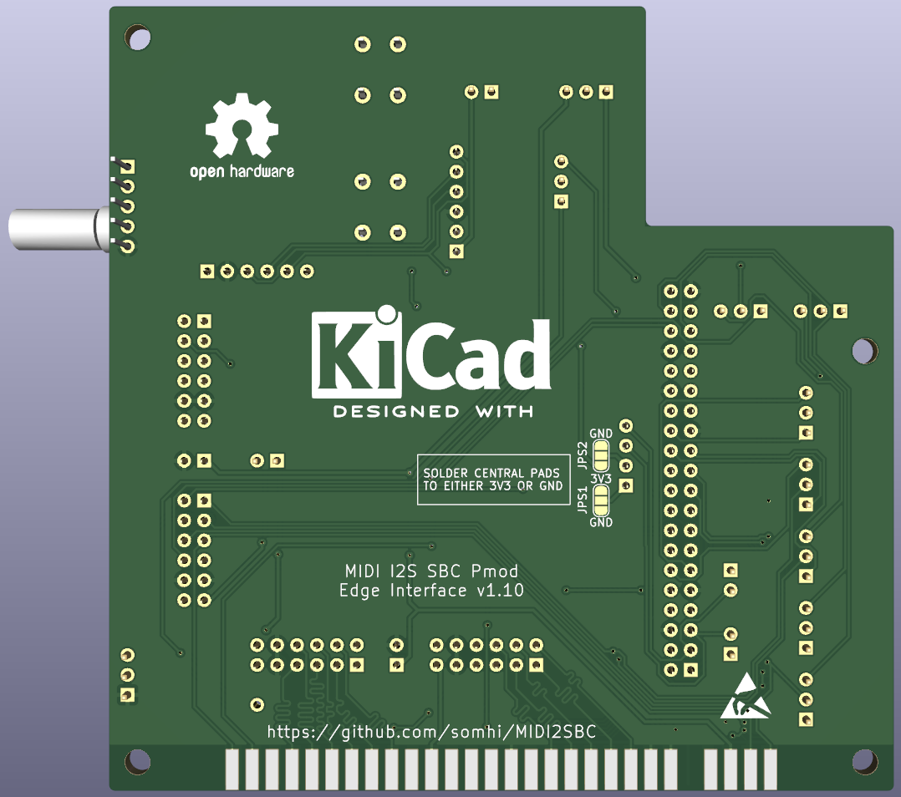

# MIDI I2S SBC Pmod Edge Interface

**STATUS (01/03/22): sent v0.70 to manufacturing at JLCPCB**

**STATUS (16/03/22): received pcbs and started testing**

This board was born as an addon for [NeptUNO](https://github.com/neptuno-fpga/Main_nepUNO/wiki) FPGA platform (although it can be linked to other FPGAs) for interfacing with a MIDI synthesizer (mt32-pi), DAC I2S, single board computers (or microcontrollers) and pmod peripherals.

This is my first PCB design attempt. 

Project has been developed with KiCAD 6.0.

This design is based on the Eagle design of the RTC+I2S+PIzero Addon from [Antonio Villena](https://www.antoniovillena.es/store/). I have to thank Antonio for his help letting me know the signals available at the Edge connector of the [NeptUNO](https://github.com/neptuno-fpga/Main_nepUNO/wiki) FPGA .

### Flow diagram

### **Schematic**

[addon-edge-rpi-i2s-pmod.pdf](addon-edge-rpi-i2s-pmod.pdf)

### **Features**

* MIDI synthesizer: [mt32-pi](https://github.com/dwhinham/mt32-pi) 
  
  * Includes footprint for and I2C OLED display, rotative encoder and 2 buttons.
  * Play MIDI sounds from FPGA core through RPi jack output or through an I2S DAC
  * Send mt32-pi I2S audio back to FPGA for mixing with other core audio and play it back through I2S DAC
  
* DAC I2S: footprints for UDA 1334A or PCM5102A
  * Play I2S audio sent from your FPGA (connected to Edge or Pmod 3)
  * Play I2S audio from Raspberry mt32-Pi (via jumpers)
  
* SBC / Micro-controller interface (Multicore)
  * Interface to FPGAs through Edge or Pmod 3 connectors
  * Interface signals: SPI (6 signals) and UART (Rx/Tx) 
  * Footprint for Raspberry Pi model B 40 pin connector. Other SBCs or microcontrollers can be interfaced through adapters (e.g. MAix BiT and STM32 are available in [Atlas FPGA project](https://github.com/atlasfpga))
  * SBC or uC can be used as a multicore device for the FPGA
  
* UART header connected to FPGA (Rx, Tx) (and also to Raspberry Pi)

* Power header from raspberry Pi (5 V, 3.3 V)

  

**Additional features for Edge connector ** 

* Compatible platforms ZXDOS+, GomaDOS+ & NeptUNO
  * NeptUNO carrier board is compatible with most of QMTech FPGAs
* PMODs 1 & 2 for double Pmod peripherals (like Hyperram, VGA, HDMI, ....)
  * Pmod 1 is connected to I2C lines of NeptUNO carrier board
  * Includes 5V power supply pin between Pmods  for broader compatibility
* PMODs 3 & 4  
  * Can be used as host or peripheral pmods (jumper enables output power)
  * Double Pmod for peripherals only if not using mt32-pi or multicore options
  * Includes 5V power supply pin between Pmods  for broader compatibility
  * Pmod 4 cannot be used with NeptUNO board usign SRAM cores

### 3D model

### **Usage notes**

* DAC I2S 
  * Only one DAC (either UDA 1334A or PCM5102A) is intended to be used at the same time
  * DAC voltage input selection jumpers (from Edge, Raspberry Pi or other FPGA)
* SPI communication between Raspberry Pi and FPGA
  * SPI 0 or SPI 1 (selection by jumpers JP4x)
* mt32-pi synthesizer
  * Power supply: JP11 set to RPI and JP12 with jumper
  * DAC source from FPGA: SPI 1 should be selected when using mt32-pi (jumpers JP4x)
  * DAC source from RPi: No jumper or SPI 0 should be selected when using mt32-pi (jumpers JP4x)

### **Jumper selection**

**Jumper types**

* 2 pin jumper is either shorted (jumper on) or disconnected (without jumper)

* 3 pin jumper is either on one side or the other always connecting the central pin

**Jumper selection**

* DAC I2S Power supply input source  

  * JP11:  RPI / EDGE   (3 pin jumper)
    * RPI (5V from Raspberry Pi)
    * EDGE (5V from Edge connector (NeptUNO FPGA))
  * JP12  (2 pin jumper)

    * Jumper shorting JP11 & VIN (5V from selection of JP11 jumper is applied to VIN)
    * Without jumper (DAC power input comes from any VIN pin (J4, J5 or J12 Vin itself))

* DAC I2S Audio Source (3 pin jumper)
  * DAC I2S connected to FPGA: I2S sound from MIDI synthesizer mt32-pi (MIDI_CLKBD, MIDI_WSBD, MIDI_DABD signals) is routed to the FPGA (where could be mixed with other core sounds) and the FPGA sends the I2S back to the DAC I2S (BCLK, WSEL, DIN signals).
    * JP21, JP22, JP23 jumper connected to the FPGA mark
  * DAC I2S connected directly to the MIDI synthesizer mt32-pi 
    * JP21, JP22, JP23   jumper connected to the RPI mark
  
* SPI selection: SPI0 or SPI1 (3 pin jumper)

  * SPI0: JP41, JP42, JP43, JP44, JP45  jumper connected to the SPI0 mark
  * SPI1: JP41, JP42, JP43, JP44, JP45  jumper connected to the SPI1 mark  
  
* Power supply selection for pins 1 and 2 of the I2C OLED display

  * You might find in the marked I2C displays that need 3V3 on pin 1 and GND on pin 2 whereas others need 3V3 on pin 2 and GND on pin 1

  * JPS1 is a 3 pad solder jumper

    * Solder central pad to either 3V3 or GND for selecting function of PS1 display pin 1

  * JPS2 is a 3 pad solder jumper

    * Solder central pad to either 3V3 or GND for selecting function of PS2 display pin 2

      

### Changelog

v0.42  last version with 25 pins

v0.50  added 10 more pins connected at Edge connector to FPGA. Those pins are shared with other peripherals (2 pins bus I2C shared with RTC and VGA connector, 8 pins shared with SRAM memory)

v0.60  routed and gerber done

v0.70 minor changes. Prototype version sent to manufacturing

v0.71 minor disalignment of Pmod 1 with Pmod 2

v0.72 silkscreen updated (midi and mt32pi settings)

**Todo**

* Support of UDA113 in the opposite header

