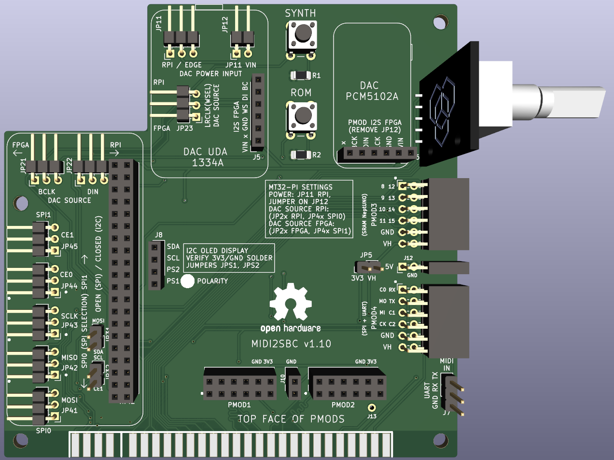

# MIDI I2S SBC Pmod Edge Interface v0.1

### **Features**

* MIDI synthesizer: [mt32-pi](https://github.com/dwhinham/mt32-pi) with Oled display, 2 buttons and rotative encoder 
  * Play MIDI sounds from FPGA core through RPi jack output or through I2S DAC
  * Send mt32-pi I2S audio back to FPGA for mixing with other core audio and play it back through I2S DAC
* DAC I2S: footprints for UDA 1334A or PCM5102A
  * Play I2S audio sent from your FPGA (connected to Edge or Pmod 3)
  * Play I2S audio from Raspberry mt32-Pi (via bypass jumpers)
* SBC / Micro-controller interface (Multicore)
  * Interface to FPGAs through Edge or Pmod 3 connectors
  * Interface signals: SPI (6 signals) and UART (Rx/Tx) 
  * Footprint for Raspberry Pi model B 40 pin connector. Other SBCs or microcontrollers can be interfaced through adapters (e.g. MAix BiT and STM32 are available in [Atlas FPGA project](https://github.com/atlasfpga))
  * SBC or uC can be used as a multicore device for the FPGA
* UART header connected to Raspberry Pi and FPGA (Rx, Tx)
* Power header from raspberry Pi (5 V, 3.3 V)

**Additional features for Edge connector ** 

* Compatible platforms ZXDOS+, GomaDOS+ & NeptUNO

* PMODs 1 & 2 for double Pmod peripherals like Hyperram, VGA, HDMI, .... 
  * includes 5V power supply pin between Pmods  for broader compatibility
* PMOD 3 can be used as host (jumper enables power)

**Additional notes**

* DAC I2S 
  * Only one DAC (either UDA 1334A or PCM5102A) is intended to be used at the same time
  * DAC voltage input selection jumpers (from Edge, other FPGA or Raspberry Pi)

* SPI communication between Raspberry Pi and FPGA
  * SPI 0 or SPI 1 (selection by jumpers)
  * SPI 1 CE2 signal only available if UART Rx is not used (jumper selection)

**Jumper Selection**

* DAC I2S Power input  

  * 3 pin jumpers selection: Jumper is either on one side or the other always connecting the central pin

  * JP11:  RPI / EDGE  

    * RPI (from Raspberry Pi)
    * EDGE (from e.g. NeptUNO FPGA)

  * JP12:  J4.J5 / JP11

    * J4.J5 (from jumper cable connected either to VIN pin from J4 or J5 connector)

    * JP11 (from selection of JP11 jumper)

      

* DAC I2S audio source selection
  * 3 pin jumpers selection: Jumper is either on one side or the other always connecting the central pin
  * DAC I2S connected to FPGA. IS2 sound from MIDI synthesizer mt32-pi (MIDI_CLKBD, MIDI_WSBD, MIDI_DABD) is routed to FPGA where could be mixed with other core sounds and then the resulting mixed I2S can be routed from FPGA to the DAC I2S (BCLK, WSEL, DIN).
    * JP21, JP22, JP23 jumper connected to left side
  * DAC I2S connected to MIDI synthesizer mt32-pi. 
    * JP21, JP22, JP23   jumper connected to right side

* Multiple function selection for pins
  * 3 pin jumpers selection: Jumper is either on one side or the other always connecting the central pin
  * UART RX / SPI1 CE2  (JP31)
  * UART TX (MIDI OUT) / PMOD2_D3  (JP32)
  
* SPI selection between SPI0 and SPI1

  * 3 pin jumpers selection: Jumper is either on one side or the other always connecting the central pin
  * SPI0: JP41, JP42, JP43, JP44, JP45  jumper connected to left side
  * SPI1: JP41, JP42, JP43, JP44, JP45  jumper connected to right side

  

### 3D model

